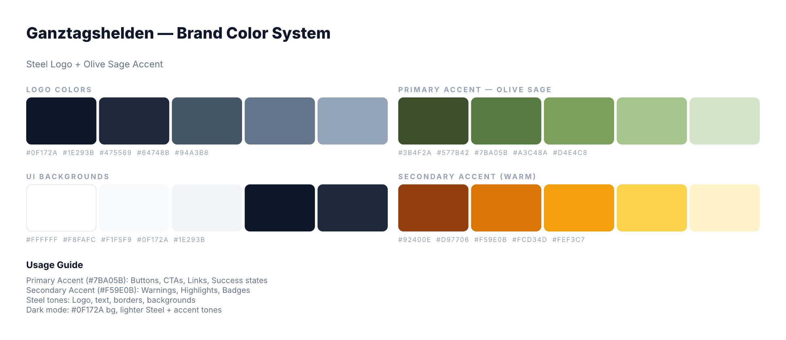

<p align="center">
  
</p>

<h1 align="center">@moto-nrw/design-system</h1>

<p align="center">
  Shared component library and design tokens for the Ganztagshelden ecosystem.<br/>
  Consumed by <strong>project-phoenix</strong>, <strong>PyrePortal</strong>, and <strong>website</strong>.
</p>

<p align="center">
  <a href="https://github.com/moto-nrw/design-system/actions"></a>
</p>

---

## Brand Color System



| Palette | Steps | Usage |
|---------|-------|-------|
| **Steel** | 50–900 (10) | Logo, text, borders, backgrounds |
| **Sage** | 100–900 (5) | Primary accent — buttons, CTAs, links, success |
| **Warm** | 50–900 (10) | Secondary accent — warnings, highlights, badges |
| **Red** | 50–600 (6) | Warm terracotta — error, destructive states |

## Components (26)

| Category | Components |
|----------|-----------|
| **Brand** | Logo |
| **Actions** | Button (7 variants, loading) |
| **Input** | Input (password toggle), Textarea, Select, SearchBar, Checkbox, Radio, Toggle |
| **Navigation** | Tabs (sliding indicator), FilterChips |
| **Feedback** | Alert, Toast, Spinner, Skeleton, StatusDot, Pill (6 colors) |
| **Overlay** | Modal, ConfirmationModal, DropdownMenu |
| **Data** | Badge, Avatar |
| **Layout** | Card (hoverable glow), Accordion, Divider |
| **Icons** | [Lucide](https://lucide.dev) (peer dependency) |

## Quick Start

```bash
pnpm install
pnpm storybook    # localhost:6006
```

## Usage in Consumer Repos

### 1. Setup (one-time)

Add `.npmrc` to the repo root:

```
@moto-nrw:registry=https://npm.pkg.github.com
```

Install:

```bash
pnpm add @moto-nrw/design-system lucide-react
```

### 2. Import Tokens

For **Tailwind v4** consumers (recommended):

```css
/* globals.css */
@import "tailwindcss";
@import "@moto-nrw/design-system/tailwind";
```

Or import CSS variables directly:

```tsx
import "@moto-nrw/design-system/tokens";
```

### 3. Use Components

```tsx
import { Button, Card, Modal, Pill } from "@moto-nrw/design-system";
import { Search, Settings } from "lucide-react";

function Example() {
  return (
    <Card hoverable>
      <Button variant="primary">Speichern</Button>
      <Pill label="Aktiv" color="green" />
    </Card>
  );
}
```

### Package Exports

```tsx
import { Button, Card, ... } from "@moto-nrw/design-system";     // components
import "@moto-nrw/design-system/tokens";                          // CSS variables
import "@moto-nrw/design-system/tailwind";                        // Tailwind v4 theme
```

## CI Setup (GitHub Actions)

```yaml
- uses: actions/setup-node@v6
  with:
    registry-url: https://npm.pkg.github.com
    scope: "@moto-nrw"

- run: pnpm install
  env:
    NODE_AUTH_TOKEN: ${{ secrets.GITHUB_TOKEN }}
```

## Development

| Command | Purpose |
|---------|---------|
| `pnpm build` | Full production build (tokens + tsup + validation) |
| `pnpm storybook` | Component playground on localhost:6006 |
| `pnpm test:run` | Run tests |
| `pnpm lint` | Lint with Biome |
| `pnpm tokens` | Regenerate CSS vars from token JSONs |
| `pnpm knip` | Find unused code |

## Release Workflow

1. Make changes + `pnpm changeset` to describe what changed
2. Commit and push to `development`
3. CI creates a "Version Packages" PR (bumps version + CHANGELOG)
4. Merge that PR — CI publishes to GitHub Packages

Consumer repos get auto-updated via Dependabot.

## License

MIT
